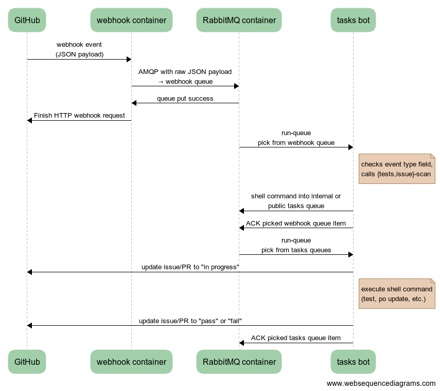

---
title: Cockpit Infrastructure
subtitle:
author:
 - Martin Pitt, Sanne Raymaekers
email: mpitt@redhat.com, sraymaek@redhat.com
theme: Singapore
header-includes:
 - \hypersetup{colorlinks=true}
 - \setbeameroption{hide notes}
...

# Cockpit Team


- Interactive Server admin web interface
- Included in all major distros, uses over 100 OS APIs
- 7 team members
- Automated tests, releases, npm/translation updates, VM/container image refreshes

:::notes
- Conceptually: Linux session running in a web browser; moral server equivalent of what GNOME is on a desktop
- talks to > 100 system APIs, times > 10 supported OSes → moving target, things break all the time
- small team, heavily dependent on infrastructure
- automated testing, releasing, code hygiene, updating VM and container images
:::

# Our Automation Principles

\qquad \qquad \qquad \qquad {width=12%} \qquad \qquad {width=12%}

Containerize everything → simple and safe to run locally

No magic infrastructure → reproducible, cloud portability

Automated deployment → scalable, recoverable, ~~bus factor 1~~

:::notes
- Formula: Containerize everything plus no magic infrastructure
- Humans first: Make it simple and enjoyable to locally hack on tests, automation, CI
- Containers are easy to reproduce, easy to run locally and on different cloud platforms/CI providers
- CI/CD uses the exact same containers and commands, just more powerful
- Deployed using publicly available ansible scripts (credentials of course are not public :D)
:::

# Which infrastructure exactly?

- GitHub workflows for all non-KVM tasks
- CentOS CI: OpenShift
- bos.e2e: systemd-controlled docker
- AWS: on-demand, \$\$\$, systemd-controlled podman

:::notes
- GitHub's infra is unlimited, free, zero admin cost, high-level SPOF (if GH goes down we have no project anyway)
- GitHub: releases, npm/translation updates, tracking of OS regressions, container refreshes
- tests need kvm access and internal network access depending on the tested OS, so those are not done on GitHub
- CentOS CI ocp: powerful, free, many nodes; no internal tests; RCs
- e2e: 10 real-iron powerful machines; internal tests and RHEL/Windows image store
- … difficult to maintain (RHEL 7, Satellite); systemd autorestart controlled docker instances
- AWS: on-demand test fallback in case e2e goes down; permanent image server backup and log store
- … fully automated using Ansible, but pricey (\$100/day)
- Always prospecting for new infrastructure :)
:::

# Event flow for releases

```sh
$ git tag -s -m '123

- cool new feature A
- fix heisenberg compensator on Fedora (rhbz#1234)
'
```

→ [.github/workflows/release.yml](https://github.com/cockpit-project/cockpit/blob/master/.github/workflows/release.yml) runs release container

→ GitHub release, Fedora dist-git+koji+bodhi, COPR, DockerHub, docs on cockpit home page

:::notes
- Explain a bit *what* we run on the infra; first example is releases
- minimized human work: summarize news, push signed tag, everything else is fully automated; plus blog post
- pushing tag triggers release workflow
- runs release container; looks at "cockpituous" script of the particular project, which controls what/where exactly to release
:::

# Event flow for tests

{height=95%}

:::notes
- tests infra is more complicated, no GH workflows
- starting point: GitHub event: something happens, like open PR; calls URL in your infra with JSON payload
- ephemeral, translate to atomic, distributed, transactional work queue: AMQP; very simple to use, robust, small
- that is done by webhook pod (simple Python script + off-the-shelf rabbit container)
- webhook is just single instance on CentOS CI; auto-recovers through PR/issue scanning (github is single source of truth)
- thus we can deal with few hours downtime, but not with days
- dozens of worker bots on various clouds connect to AMQP, grab next task, ack it after task is done, logs stored, and GitHub status updated
:::

# Strong aspects of our CI

- reproducible, portable
- platform agnostic work queue
- deployment only through Ansible
- fully automated releases
- separate changes in our code from changes in OSes

:::notes
- make use of hybrid cloud; harness lots of powerful resources whereever we can get them
- robust and simple work queue (Jenkins is magnitudes more complicated, brittle, harder to maintain and use)
- Intro mentioned combinatorial explosion of OSes times APIs; we are everybody's OS regression test
- became good at isolating our changes from ever-changing/regressing OSes around us; offline tests against static VMs
- fully automatic tracking of OS regressions
:::

# Weak aspects/challenges of our CI

- arcane test logging and artifacts
- precarious e2e machines
- no monitoring/alerts
- hard to find public infra with /dev/kvm

:::notes
- our test logging/artifact infra is very arcane, too much custom logic; needs SSH, SPOF; want to move to standard infra (http post, s3, loki, etc.)
- e2e machines are ever more difficult to keep running; old and no automation around Satellite; need well-maintained internal infra
- use host journal and k8s container logs for investigating failures; no automated monitoring (except for email on bot crash), notification, or prevention
- has not been a big enough pain point in part due to reproducibility of queue state
- hard to find public infra with /dev/kvm: Travis for a while, but they stopped having free plans
:::

# Links/Documentation
- [source.redhat.com/groups/public/cockpit/ cockpit_wiki/cockpit_ci_resources](https://source.redhat.com/groups/public/cockpit/cockpit_wiki/cockpit_ci_resources)
- [github.com/cockpit-project/cockpituous/](https://github.com/cockpit-project/cockpituous/)
- secrets in internal CEE GitLab repo, only accessible to a few team members
- [github.com/cockpit-project/bots](https://github.com/cockpit-project/bots)
- `#cockpit` on Freenode, [cockpit-devel@lists.fedorahosted.org](https://lists.fedorahosted.org/archives/list/cockpit-devel@lists.fedorahosted.org/)

:::notes
- finally, where can you look at our stuff and steal or contribute
- top-level document on the source, describes available internal and external infra, lots of pointers
- public cockpituous repo has all our infra automation (Ansible) and most of our containers
- secrets like Fedora password, GitHub or COPR token are in a very restricted internal CEE GitLab repo
- bots is the code that runs inside containers; grab AMQP work queue item, invoke test, update
  translations, build VM image
- you can always say hi on IRC or ask on our mailing list
:::
