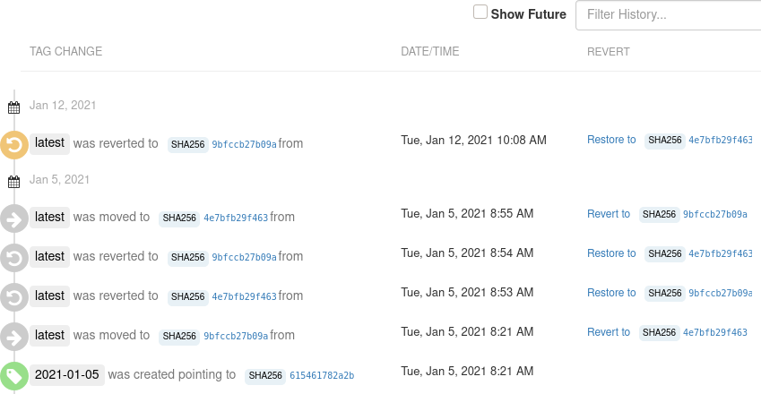

---
title: How we hack on Cockpit Infrastructure
subtitle:
author:
 - Martin Pitt, Sanne Raymaekers
email: mpitt@redhat.com, sraymaek@redhat.com
theme: Singapore
header-includes:
 - \hypersetup{colorlinks=true}
 - \setbeameroption{hide notes}
...

# Goal

infrastructure ~ code

PR → container rebuilds, private temp deployment, validate against product main branches

land PR → redeploy to production

:::notes
- most of us have become really good at self-validating changes to our product code with test gating
- ideal: want to treat changes to infrastructure alike: submit a PR, builds changed container images
- in Cockpit team we have some aspects of that, but still quite far from that ideal
- takes a lot of learning of new concepts and infrastructure, needs to offset the cost of classic deploy-watch-rollback
:::

# Updating unit test container

[.github/workflows/unit-tests.yml](https://github.com/cockpit-project/cockpit/blob/master/.github/workflows/unit-tests.yml):

\footnotesize
```yaml
name: unit-tests
on: pull_request
[...]
  - name: Build unit test container if it changed
    run: |
      changes=$(git diff origin/master..HEAD --
                containers/unit-tests/)
      [ -z "$changes" ] || podman build \
        --tag ghcr.io/cockpit-project/unit-tests \
        containers/unit-tests/

  - name: Run unit-tests container
    run: |
      podman run -v $(pwd):/source:ro \
         ghcr.io/cockpit-project/unit-tests
```

:::notes
- a simple case where this works well is our unit-tests container for cockpit
- you see simplified workflow that runs on PRs
- normal PRs pull container from the registry
- PR that touches anything in the container definition rebuilds the container, and runs unit tests against that local build
- provides self-validation that we want
- fairly new, currently missing: automatically refresh the container on registry on landing
:::

# Keeping unit-tests container up to date

[workflows/unit-tests-refresh.yml](https://github.com/cockpit-project/cockpit/blob/master/.github/workflows/unit-tests-refresh.yml)

\footnotesize
```yaml
on:
  schedule:
    # auto-refresh every Sunday evening
    - cron: '0 22 * * 0'
[...]
  - name: Build fresh containers
    run: |
      podman build --tag ghcr.io/cockpit-project/unit-tests \
         containers/unit-tests/

  - name: Run amd64 clang test
    run: containers/unit-tests/start CC=clang

  - name: Push containers to registry
    run: podman push ghcr.io/cockpit-project/unit-tests
```

:::notes
- because unit-tests container is easy to self-validate, we can keep it up to date automatically
- every week a scheduled workflow rebuilds the container, runs all unit test scenarios
- if they succeed, push it to the registry
- if they fail, GitHub sends a failed workflow notification email; investigate
- in the latter case, PRs just keep using the previous container; no urgency
:::

# Developing GitHub workflows

Test on your fork:

- example: [cockpit-ostree npm-update](https://github.com/cockpit-project/cockpit-ostree/pull/154)

- example: [homepage docs auto-update](https://github.com/cockpit-project/cockpit-project.github.io/pull/364)

[Interactive SSH for debugging](https://github.com/mxschmitt/action-tmate):

    uses: mxschmitt/action-tmate@v3

:::notes
- Almost trivial, just for completeness
- No persistent deployment for GitHub; this "serverless" architecture avoids the whole initial problem
- Anyone can test changes on their own project fork, assuming that the workflow
- the two real-life examples are clickable links, if you want to peek into how that looks like
- Biggest stumbling block there are secrets -- you may need corresponding "forks" on quay.io, or upload the official secrets to your own forked project
- standard action on the market place for getting interactive ssh into the GitHub VMs
:::

# Updates to deployed infrastructure

\qquad \qquad \qquad \qquad {width=12%} \qquad \qquad {width=12%}

Simple revert on [quay.io tag history](https://quay.io/repository/cockpit/tasks?tab=history):

{width=80%}

:::notes
- anything that touches our deployed infrastructure has no particular magic
- these are farthest away from that goal, fortunately also rare
- updating tasks container: send PR, build/push/deploy it, trigger/wait for some representative test runs, watch out for regressions
- we can run the new container locally or on the infra and do a smoke test
- quay.io offers a nice and simple way to revert a tag on the web UI (easier than on the CLI)
- similar situation with changes to kubernetes resources, Ansible scripts, etc.
- we don't have sharding of our infra and per-developer tenants
- so we usually deploy right to production and roll back on failure
:::
